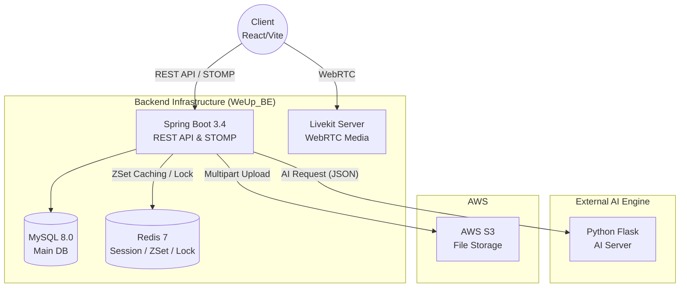
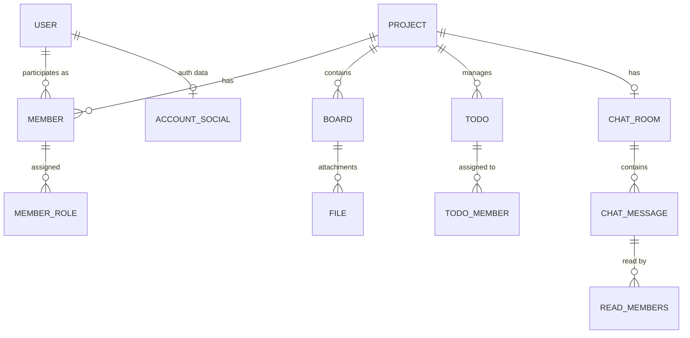

# 🚀 WeUp_BE - AI 융합 대학생 팀 프로젝트 협업 플랫폼

<div align="center">
  
  
  
  
  
  
</div>

## 📋 목차
- [🎯 프로젝트 개요](#-프로젝트-개요)
- [⚡ 핵심 가치 및 기술](#-핵심-가치-및-기술)
- [💡 주요 도메인 기능](#-주요-도메인-기능)
- [🔥 기술적 의사결정 및 트러블 슈팅](#-기술적-의사결정-및-트러블-슈팅)
- [🏗️ 시스템 아키텍처 및 ERD](#-시스템-아키텍처-및-ERD)
- [🛠️ 기술 스택](#-기술-스택)
- [✅ 개인 기여 부분](#-개인-기여-부분)
- [🚀 시작하기 (로컬 환경)](#-시작하기-로컬-환경)

---

## 🎯 프로젝트 개요
**WeUp**은 대학생들의 효율적인 팀 프로젝트 수행을 돕기 위해 기획된 All-in-One 협업 플랫폼입니다. 

단순한 일정/할 일 관리를 넘어, **WebRTC 기반의 실시간 화상 회의**, **Redis 최적화 기반의 실시간 채팅**, 그리고 Flask 서버와 연동된 **AI 비서 기능**을 제공하여 비대면 상황에서도 압도적인 팀워크와 생산성을 지원합니다.

---

## ⚡ 핵심 가치 및 기술

| 🧠 AI 어시스턴트 연동 | 🚀 대규모 트래픽 최적화 (Redis) | 🎥 실시간 화상 통화 (WebRTC) | 🔒 견고한 인프라 및 보안 |
| :--- | :--- | :--- | :--- |
| **자연어 처리 기반 자동화:**<br>대화 문맥을 분석하여 역할 자동 할당, 회의록을 자동 요약하여 게시판에 등록 등의 기능을 제공합니다. | **채팅 캐싱 및 동시성 제어:**<br>채팅은 Redis `ZSet`에 캐싱되어 MySQL 부하를 줄이고, 프로젝트 동시 편집 시 Redis 분산 락을 통해 충돌을 방지합니다. | **LiveKit Server 구축:**<br>자체 LiveKit 서버와 Coturn을 연동하고, 백엔드에서 사용자 인증이 포함된 WebRTC JWT 토큰을 직접 발급합니다. | **소프트 삭제 및 인덱스 튜닝:**<br>복합 Unique Index를 통한 DB 성능 최적화 및 논리적 삭제(Soft Delete)를 통한 데이터 정합성을 보장합니다. |

---

## 💡 주요 도메인 기능

- **🤖 AI 비서 (AiChatService)**
  - 대화 내역(`startTime` ~ `endTime`)을 추출해 AI Flask 서버로 전송하여 회의록 자동 생성
  - 대화 문맥을 파악하여 팀원의 역할(Role) 자동 할당 및 Todo 자동 생성
- **💬 실시간 채팅 (ChatService & WebSocketConfig)**
  - `STOMP`를 활용한 실시간 채팅 및 알림 브로드캐스팅
  - 과거 메시지는 MySQL에서, 최신 메시지는 Redis에서 조회하여 병합 제공
- **📹 실시간 화상회의 (LiveKitService)**
  - `LiveKit JWT` 발급 로직 내재화 (사용자 프로필, 권한 메타데이터 포함)
  - Redis Set을 활용한 현재 화상회의 참여자 수 및 상태 실시간 추적
- **👤 회원 및 인증 (UserService & MailService)**
  - JavaMailSender를 활용한 SMTP 기반 이메일 인증 회원가입
  - Custom ArgumentResolver(`@LoginUser`)를 통한 전역적이고 안전한 권한 체크
- **📋 프로젝트 및 일정 관리 (Project/Todo/ScheduleService)**
  - 보드(Board) 중심의 게시글 작성 및 AWS S3를 활용한 다중 첨부파일(File) 관리

---

## 🔥 기술적 의사결정 및 트러블 슈팅

### 1. 🗄️ 대용량 채팅 내역 조회 성능 최적화 (Redis ZSet)
*   **배경:** 실시간 채팅의 특성상 메시지 저장 및 조회가 매우 빈번하게 일어납니다. 모든 메시지를 RDBMS(MySQL)에만 저장하고 조회할 경우, 디스크 I/O 병목으로 인해 심각한 지연이 발생할 수 있었습니다.
*   **해결:** 최신 채팅 내역은 Redis의 Sorted Set(`ZSet`)에 타임스탬프(`sentAt`)를 Score로 하여 캐싱했습니다. 채팅방 입장 시, 과거 데이터는 MySQL에서 가져오고 최신 데이터는 Redis `ZSet`의 `rangeByScore`로 가져와 메모리 단에서 O(log(N))의 속도로 빠르게 병합하여 응답 속도를 획기적으로 개선했습니다.

### 2. ⚡ 프로젝트 정보 수정 시 동시성 이슈 해결 (Redis Distributed Lock)
*   **배경:** 여러 명의 팀원이 동시에 프로젝트 설명(`Description`)을 수정하려고 할 때, Race Condition이 발생하여 데이터가 덮어씌워지는 Lost Update 문제가 있었습니다.
*   **해결:** 낙관적 락 대신, 실시간 편집 상태를 브로드캐스팅하기 좋은 Redis의 `setIfAbsent`(SETNX)를 활용하여 분산 락을 구현했습니다. 특정 사용자가 수정을 시작하면 TTL 동안 락을 점유(`lock:project:{id}`)하고, STOMP를 통해 다른 유저들에게 `EDIT_LOCK` 이벤트를 발행하여 UI 단에서 수정을 원천 차단하는 UX/기능을 완성했습니다.

### 3. 🛡️ XSS / CSRF 공격을 고려한 안전한 JWT 인증 아키텍처
*   **배경:** 프론트엔드(React) 환경에서 토큰을 LocalStorage에만 저장할 경우 XSS 공격에 취약해집니다.
*   **해결:** 수명이 짧은 `Access Token`은 JSON 응답 바디로 내려주어 프론트엔드 메모리 단에서 관리하게 하고, 수명이 긴 `Refresh Token`은 백엔드에서 직접 `HttpOnly`, `SameSite=Lax(배포 시 None)` 속성이 적용된 쿠키(Cookie)로 구워 브라우저에 전달하도록 분리 설계하여 보안성을 크게 높였습니다.

### 4. 🗃️ DB 데이터 정합성 보장을 위한 논리적 삭제(Soft Delete) 설계
*   **배경:** 회원이 탈퇴하거나 프로젝트에서 나가게 될 경우 데이터를 물리적으로 삭제(`DELETE`)하면, 과거 채팅 기록이나 연관된 게시글의 참조 무결성이 깨져 서비스 운영에 치명적인 오류를 낳을 수 있습니다.
*   **해결:** `User` 및 `Member` 엔티티에 `is_user_withdrawal`, `deleted_at` 등의 필드를 두어 Soft Delete 방식을 도입했습니다. 이를 통해 과거의 데이터 흐름을 안전하게 보존하면서도 복구 기능을 유연하게 제공할 수 있는 실무적인 아키텍처를 구현했습니다.

### 5. 🚀 복합 인덱스(Composite Index)를 활용한 채팅 읽음 처리 성능 튜닝
*   **배경:** 다수의 사용자가 채팅방에서 메시지를 읽을 때마다 '읽음' 상태를 저장해야 하는데, 중복 데이터가 쌓이거나 조회 속도가 저하될 우려가 있었습니다.
*   **해결:** `ReadMembers` 엔티티(JPA)에 `@Table(indexes = @Index(name = "ux_read_members_msg_member", columnList = "message_id, member_id", unique = true))` 옵션을 선언했습니다. 이를 통해 무결성을 DB 단에서 강제함과 동시에, 메시지 ID와 멤버 ID를 결합한 Unique Index 튜닝을 통해 대량의 트래픽 속에서도 '읽음' 상태 조회 속도를 최적화했습니다.

---

## 🏗️ 시스템 아키텍처 및 ERD

### System Architecture (mermaid)


### System Architecture


### Database ERD (mermaid - Simplified)


### Database ERD (ERDCloud)


---

## 🛠️ 기술 스택

### 🎨 Backend Framework & Library
- **Java 21**, **Spring Boot**
- **Spring Security** (JWT 기반 Stateless 인증)
- **Spring Data JPA** (Hibernate)
- **WebSocket & STOMP** (실시간 통신)

### 💾 Database & Cache
- **MySQL** (기본 RDBMS)
- **Redis** (채팅 캐싱, 분산 락, 화상회의 세션 관리)

### 🤖 AI & Real-time Media
- **Python (Flask)** (자연어 처리 외부 AI 서버 연동)
- **LiveKit** & **Coturn** (WebRTC 화상/음성)

### 🔧 DevOps & Cloud
- **Docker & Docker Compose** (컨테이너화)
- **AWS S3** (클라우드 스토리지)
- **GitHub Actions** (CI/CD 파이프라인)

---

## ✅ 개인 기여 부분

다중 사용자 환경에서 발생하는 **동시성 문제**와 **실시간 동기화 이슈**를 주도적으로 해결하며 끊김 없는 협업 UX를 구현했습니다.

또한 **코어 비즈니스 로직**(채팅 동기화, 인증/인가, 프로젝트 관리 등)과 **클라우드 인프라**(AWS S3, CI/CD) 구축을 전담하고,
Rich Domain Model 기반의 **객체지향적 리팩토링**을 통해 시스템의 완성도를 높였습니다.

### 1. 🔒 프로젝트 소개말 실시간 동시성 제어 및 UX 최적화 (Concurrency Control & Real-time Locking)
   * Redis의 SETNX(setIfAbsent)를 활용하여 분산 락을 구현, 다중 사용자의 동시 수정 접근으로 인해 발생하는 Lost Update 문제를 데이터베이스 접근 이전에 사전 차단.
   * 락 획득 및 해제 시 STOMP 웹소켓 기반의 EDIT_LOCK / EDIT_UNLOCK 이벤트를 연결된 클라이언트들에게 즉각 브로드캐스팅하여 다른 팀원들의 UI를 실시간으로 비활성화/활성화 처리하는 파이프라인 구축.
   * Redis 락에 3분의 TTL을 설정하여, 클라이언트의 비정상 종료나 네트워크 단절 시 발생할 수 있는 데드락 현상 방지 및 시스템 안정성 확보.

### 2. ⚡ 대용량 트래픽 대비 Redis 도입 및 최적화
*   매번 AWS API를 호출해야 하는 S3 Presigned URL 발급 병목을 해소하기 위해, Redis 기반의 URL 캐싱 레이어를 도입하여 응답 속도 최적화.
*   기존 RDBMS에 저장되던 Refresh Token을 Redis로 마이그레이션하여 인증 서버의 부하 최소화 및 토큰 만료 관리 효율화.
*   프로젝트 정보 수정 시 발생하는 동시성 충돌을 방지하기 위해 Redis 분산 락(SETNX)을 도입하고, 실시간 웹소켓 이벤트 브로드캐스팅 파이프라인 구축.

### 3. 🛡️ 아키텍처 개선 및 리팩토링 (Rich Domain Model)
*   무분별한 Setter 사용을 지양하고, 비즈니스 로직을 엔티티 내부로 응집시키는 **Rich Domain Model(풍부한 도메인 모델)** 기반으로 `Todo`, `Notification`, 회원 탈퇴 로직 등을 리팩토링.
*   순환 참조 오류 해결 및 전반적인 코드 의존성 구조 개선.
*   Soft Delete 도입 및 연관된 엔티티들(User/Member)의 상태가 일관되게 변경되도록 도메인 이벤트 및 예외 처리 로직 강화.

### 4. 💬 실시간 채팅 및 AI 메시징 고도화 (Chat & AI Logic Extension)
*   일반 유저 채팅과 AI 비서의 채팅 로직을 명확히 분리하여 데이터 정합성 유지 (`isPrompt` 필드 및 플래그 추가).
*   AI가 작성한 회의록 및 역할 할당 내역을 STOMP를 통해 클라이언트에 실시간 동기화하는 파이프라인 구축.
*   채팅 읽음 처리(readUsers, lastReadAt) 및 페이징 로직 설계.

### 5. 🚀 인프라 및 CI/CD 파이프라인 구축
*   GitHub Actions를 활용하여 **배포 자동화 파이프라인 구축**.
*   Spring Boot Profile 환경 분리 및 로깅 시스템(Logback) 세팅.

## 🤝 팀원 개발 부분 및 협업 (본인 미구현)

  아래의 기능들은 팀원이 주도하여 개발하였으나, 주기적인 코드 리뷰와 페어 프로그래밍을 통해 로직의 흐름과 아키텍처를 명확히 파악하고 상호 피드백을 진행했습니다.
   * WebRTC 화상회의: LiveKit 서버 인프라 연동 및 클라이언트 JWT 토큰 발급 비즈니스 로직.
   * WebSocket 세션 관리: STOMP 채널 인터셉터(Channel Interceptor) 구현 및 Redis를 활용한 실시간 세션 상태 관리.
   * 기본 도메인 로직: 게시판(Board), 일정(Schedule) 등의 도메인 CRUD

---

## 🚀 시작하기 (로컬 환경)

## 실행 환경

```
- JDK 21
- Gradle
- Docker
- IntelliJ IDEA (권장)
```

## 실행 방법

### 1. 저장소 클론

```
git clone https://github.com/2025IR/WeUp_BE.git
cd WeUp_BE
```

### 2. 환경 변수 설정

프로젝트 실행에 필요한 환경 변수를 .env 파일을 통해 설정합니다.

필요 시, 함께 제공한 .env.example 파일을 .env로 변환하여 사용하실 수 있습니다.

```
cp .env.example .env
```

### 3. Mysql 실행 (Docker)

.env.example을 그대로 사용한다고 가정한 명령어입니다.

.env 파일을 직접 설정하실 경우 명령어도 그에 맞게 수정해야 할 수 있습니다.

```
docker run -d \
  --name weup-mysql \
  -e MYSQL_ROOT_PASSWORD=123 \
  -e MYSQL_DATABASE=db \
  -e MYSQL_USER=123 \
  -e MYSQL_PASSWORD=123 \
  -p 8082:3306 \
  mysql:8.0
```

확인 방법:

```
docker ps
docker logs weup-mysql
```

### 4. Redis 실행 (Docker)

.env.example을 그대로 사용한다고 가정한 명령어입니다.

.env 파일을 직접 설정하실 경우 명령어도 그에 맞게 수정해야 할 수 있습니다.

```
docker run -d \
  --name weup-redis \
  -e REDIS_PASSWORD=1223 \
  -p 6379:6379 \
  redis:7 redis-server --requirepass 1223
```

확인 방법:

```
docker ps
docker logs weup-redis
```

### 5. Livekit 실행 (Docker)

livekit.yaml 설정 파일을 기반으로 컨테이너를 실행합니다.

필요 시 .env 파일처럼 수정하여 사용하실 수 있으며, 이 경우 명령어 역시 그에 맞게 수정해야 할 수 있습니다.

livekit.yaml 파일은 아래와 같이 위치시킬 수 있습니다:

```
WeUp_BE/
├─ livekit/
│  └─ livekit.yaml
├─ coturn/
│  └─ turnserver.conf
├─ src/
├─ build.gradle
└─ ...
```

명령어:

```
docker run -d \
  --name weup-livekit \
  -v $(pwd)/livekit/livekit.yaml:/etc/livekit.yaml \
  -p 7880:7880 \
  -p 7881:7881 \
  -p 7882-7999:7882-7999/udp \
  livekit/livekit-server:latest \
  --config /etc/livekit.yaml
```

livekit.yaml:

```
port: 7880
log_level: info

rtc:
  use_external_ip: true
  stun_servers:
    - "coturn:3478"
  port_range: 7882-7999

keys:
  weup-livekit-key: a7lpgym54w2kdq3uhfsvbj9iecxr60mztno8akvgby14w5dqsf

turn:
  enabled: true
  udp_port: 3478
  domain: livekit.io

```

확인 방법:

```
docker ps
docker logs weup-livekit
```

### 6. Coturn 실행 (Docker)

turnserver.conf 설정 파일을 기반으로 컨테이너를 실행합니다.

필요 시 .env 파일처럼 수정하여 사용하실 수 있으며, 이 경우 명령어 역시 그에 맞게 수정해야 할 수 있습니다.

turnserver.conf 파일 역시 아래와 같이 위치시킬 수 있습니다:

```
WeUp_BE/
├─ livekit/
│  └─ livekit.yaml
├─ coturn/
│  └─ turnserver.conf
├─ src/
├─ build.gradle
└─ ...
```

명령어:

```
docker run -d \
  --name weup-coturn \
  -v $(pwd)/coturn/turnserver.conf:/etc/turnserver.conf \
  -p 3478:3478 \
  -p 3478:3478/udp \
  -p 49160-49200:49160-49200/udp \
  coturn/coturn:latest -c /etc/turnserver.conf
```

turnserver.conf:

```
fingerprint
use-auth-secret
static-auth-secret=a7lpgym54w2kdq3uhfsvbj9iecxr60mztno8akvgby14w5dqsf
realm=livekit.io
server-name=coturn
listening-port=3478
external-ip=210.119.104.149/172.17.0.1
min-port=49160
max-port=49200
```

확인 방법:

```
docker ps
docker logs weup-coturn
```

### 7. Spring Boot 실행

두 가지 방식 중 편한 방식을 선택하세요:

**개발 모드 실행** (Gradle 필요, 빠르게 실행):

```
./gradlew bootRun --args='--spring.profiles.active=prod'
```

**빌드 후 실행** (운영/배포와 동일한 방식):

```
./gradlew clean bootJar
java -jar build/libs/*.jar --spring.profiles.active=prod
```

### 8. 실행 확인

서버 실행 후 접속:

```
http://localhost:8080/welcome
```

실행이 정상적으로 완료되었을 시, 다음과 같은 문구가 출력됩니다:

```
🎉 팀 프로젝트 관리 웹, we:up에 오신 걸 환영합니다!
```
